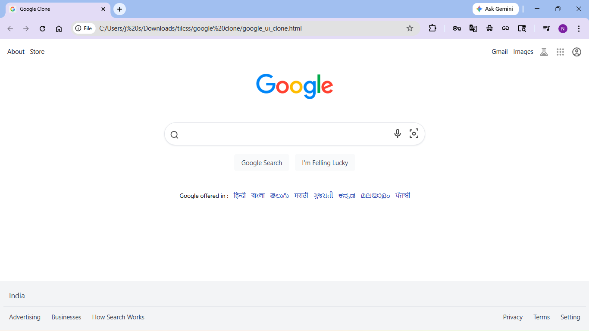

# Google Homepage Clone

A responsive Google homepage clone built using HTML and Tailwind CSS.

This project recreates the UI of Google's search homepage including:
- Navigation bar
- Search input section
- Icons and buttons
- Footer section
- Responsive layout styling

---

## Features

- Responsive Google homepage UI
- Built using Tailwind CSS
- Modern flexbox layout
- Search bar with icons
- Footer and navigation sections
- Clean and lightweight frontend project

---

## Technologies Used

- HTML5
- Tailwind CSS
- Flexbox
- SVG Icons

---

## Project Structure

```text
google-clone/
│
├── google_ui_clone.html
├── README.md
└── src/
    └── google_clone.png
```

---

## Screenshot



---

## How to Run

Simply open the HTML file in browser:

```bash
google_ui_clone.html
```

Or use VS Code Live Server extension.

---

## Learning Outcome

Through this project, I practiced:

- Tailwind CSS utility classes
- Responsive web design
- Flexbox layouts
- HTML page structuring
- UI cloning practice
- Frontend styling concepts

---

## Preview

This project is a frontend UI clone created for learning and practice purposes only.